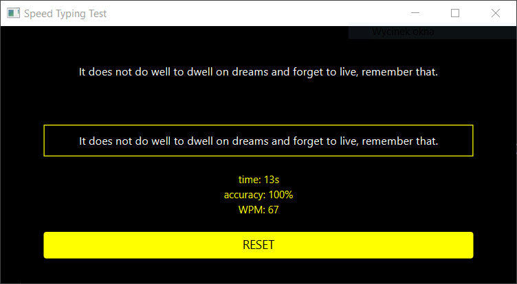

# Speed Typing Test

A window application using JavaFX framework
that implements a speed typing test with follow features:
* generate random sentences from text file
* count typing time (in seconds) accuracy and wpm (words per minute)
* reset (generate a new sentence and reset previous statistics)

Accuracy is calculating as: <strong>number of correctly typed words / the number of words in the sample sentence * 
100</strong>

To add more sentences you need to edit /src/main/resources/com/dmarcini/app/files/<strong>sentences.txt</strong> file.

---

## Screenshot



---

## Technology
* Java SE
* JavaFX
* Apache Maven

---

## Requirements
* Java SE 14 JRE installed
* Apache Maven 3.6.x installed (at least)

---

## Building & Running
Example for Linux system
```
git clone https://github.com/dmarcini/spped-typing-test
cd speed-typing-test
mvn package

java -jar target/speed-typing-test-1.0-SNAPSHOT.jar
```


